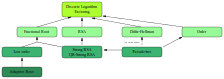

# Cash for breaking RSA assumptions

{:class="img-responsive"}

The Ethereum foundation has announced $28,000 USD and 29 ETH in a bounty program to test the validity of two new RSA assumptions: The **adaptive root assumption** and the **low order assumption**. 

 * The adaptive root assumption states that it is difficult to find a root of a given element, even when you've chosen that element yourself
 * The low order assumption states that it is difficult to find an element of low order in an RSA group

These assumptions are needed for the two different proof types in RSA VDFs: The [Wesolowski construction](https://eprint.iacr.org/2018/623.pdf) is based on the adaptive root assumption, and the [Pietrzak construction](https://eprint.iacr.org/2018/627.pdf) needs the low order assumption.

## Where now?

 * Straight to the [bounties](bounties)
 * More on the [RSA assumptions](rsa-assumptions)
 * More on [Verifiable Delay Functions](https://vdfresearch.org)
